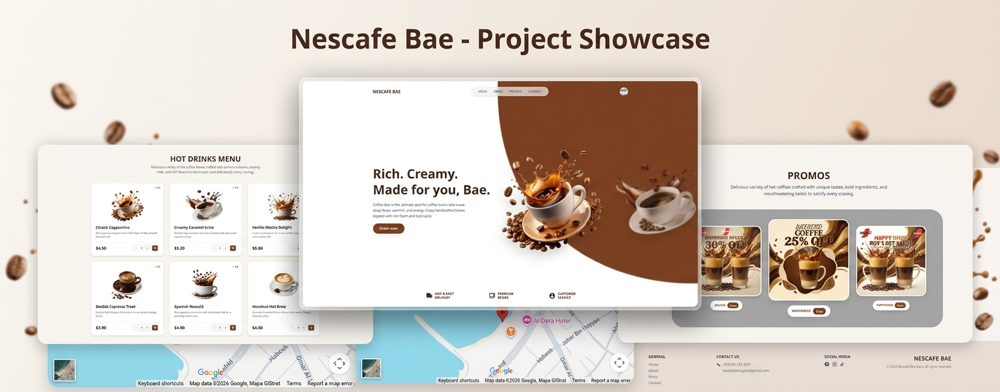

  <h1>☕ Nescafe Bae — Gaza Beach Cafe</h1>
  
  

    موقع إلكتروني كافيه تفاعلي وحديث مخصص لـ <b>Nescafe Bae</b> الواقع على كورنيش شاطئ غزة. يقدم تجربة مستخدم سلسة وعرضاً جذاباً للمشروبات الساخنة والعروض الخاصة.
  

  <!-- صورة المعاينة الاحترافية -->
  

   
   

  <!-- Badges التقنيات المستخدمة -->
  
  
  
  

---

## 🌟 الميزات الرئيسية (Key Features)

* **قسم رئيسي حيوي (Hero Carousel):** استعراض حركي دائري وتلقائي لصنوف النسكافيه بفضل مكتبة `Framer Motion`.
* **قائمة مشروبات تفاعلية (Interactive Menu):** تصفح المشروبات الساخنة مع تقييماتها، وإمكانية تعديل الكميات وسلة المشتريات بشكل فوري.
* **بطاقات العروض (Promos Section):** عرض للعروض والخصومات مع خاصية **نسخ كود الخصم بضغطة زر واحدة** إلى الحافظة (`Clipboard`).
* **خريطة تفاعلية وموقع مخصص (Location & Map):** إدماج خريطة تفاعلية توضح موقع الكافيه على شارع الرشيد (كورنيش البحر - غزة).
* **تصميم متجاوب بالكامل (Fully Responsive):** متوافق مع كافة أجهزة الموبايل، الآيباد، وشاشات الحواسيب بفضل **Tailwind CSS**.

---

## 🛠️ التقنيات المستخدمة (Tech Stack)

* **Frontend Framework:** React.js
* **Styling:** Tailwind CSS
* **Animations:** Framer Motion (AnimatePresence & Layout Animations)
* **Icons:** Custom SVG Icons
* **Build Tool:** Vite / Create React App

